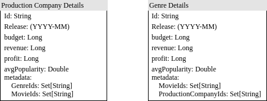

# Ingestion Implementation

## Requirements and Running

Included is Paul Phillips' sbt extra script to run the project within the project. So long as you have Java installed. All you have to do in order to run this is: 

`./sbt "run $path/to/movies_metadata.csv [datefilter]"`

date filter is optional, but will only process and overwrite files past that date.

## Basic Data model

## Output

This process will write files to `./output/(genreDetails/prodCompanyDetails)/$year/$year-$month.json`. Json was choosen out of simplicity. This could be in a columnar format such as parquet, which would make aggegrations easier to compute and faster (vectorized).

## Assumptions
Monthly ingestion happens on the entirety of the data set, i.e. not a diff or only new movies are present.

Movies that are not released or have missing (or zero) revenue will be skipped. Skipping the missing/zero revenue movies elimates a lot of movies. I'm not sure if the revenue was not released publicly, never reported or missing. In order to have accurate data for profits we need both budget and revenue.

The external API will not read this data directly. This is only the first ingestion process and another will pick up this data to further store it.

## Details

The process will start decoding the csv file line by line in case of very large datasets. Any rows of data that cannot be decoded are discarded (not currently logged, but could be to track down and correct broken records where possible). Rows not discarded are filtered/validated before being processed. Right now only the only filters are: revenue > 0 and status equals "released." Further validation could be put in place. With Production Companies and Genre fields being embedded Json this parsing is deferred as it's expensive and was not used in validation. Each production company and genre are treated as a single entity that share the revenue.

Detail collectors are sorted by year (unknown arity; so a sorted map is used) and month (finite arity; array is used 0 = January, December = 11). Within the month category a detail for each id is used (Map('id -> detail)). Details are accumulated with a sum function in order to keep memory overhead low (no individual movie row lingers in memory). Metadata details such as genre id, movie id, and production are keep around for backtracking.

After processing the internal detail maps within the months are eliminated/flattened as we do not need the quick lookups for aggregations. This represents the final layout of how the data will be stored on disk. This data is written as described in the output section as json.

## Optimization
A few optimizations can be put in place. 
- The csv reader can use much faster backend if needed. 
- Further filter to not ingest unnecessary data
- Optional collect metadata for genres and production company details
- Sparely use mutable data structures

## Future enhancements
- Write a last run file
- Collect first and last consumed releases (probably belongs in the last run file for further filtering)
- Write to different format than json. Maybe a columnar format to support lots of aggregated fields.
- Backfill for missing months (see what files are missing?)

## Monthly Ingestion 
The optional date filter can used to only ingest the previous month's movies. One thing I do not understand is how often revenue is updated. So for instance if it's just box office revenues maybe it's only a few days after the release. In that case we could filter for previous two months recommputing the two months prior and overwriting existing months. This is in part why I broke down the granularity to months in the process fewer items.

## Monitoring & Alerting
With storage granularity the same as the ingestion rate, i.e. monthly, monitoring can be done per run to check if the previous month's file exists along with the last run file. The last run file be periodically written (after x number of entries) with a field indicating it was completed or not. 

# API

## Ingestion

After the initial ingestion process another process will store it for consumption. As these are aggregates it may be wise to use a database optimized for that work load, i.e. OLAP such as Clickhouse or Snowflake. Using the same data model as the ingestion process, we can store that as tables in that DB. Then there can be precomputed/materialized views for prior years that rollup the monthly data and a view that queries the current year's monthly data as an estimate for that year to date.

## Assumptions
There are other ingestion processes that work on movies alone, and a process that grabs detailed information about the genres (i.e. name, aliases, etc.) and production companies (name, location, etc.). This could be stored in the same or different DB. It's likely to be static so a RDMS such as Postgres might be useful. Although you loose referential integrity between Ids in the metadata.

The user is external, but is required to use an API key.

## API Design

Probably something like `/v1/(production_companies|genres)/year/$year/?[top=n,ids=[1,2,3],buttom=n,metadata=true]` which returns json similar to the data model with some extras such genre name, or the production company details. Json is addititive.

With monthly granularity we could expand the analytics to be monthly.

## Authentication
User will have an account with an associated api-key in order to use this API.

## Scaling
There are many ways to scale this systems.
- Caching such as Redis/Memecached as a read-thru cache. Obviously this could be local to the API server or another cluster to maintain and monitor.
- With monthly ingestion process, we could create negative caches using bloomfilters on IDs and/or year/month. If we an end user hitting us with random data, i.e. DDOS, that'd prevent hitting the database and caching systems too hard. Returning an 404 immediately. This could be cached or just pushed out monthly.
- Rate-limiting per api-key or IP address. Mitigate bad actors using our API.
- Proper indexing in the DB for faster lookups.
